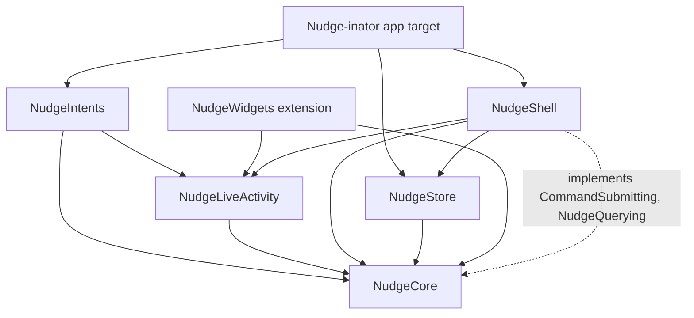
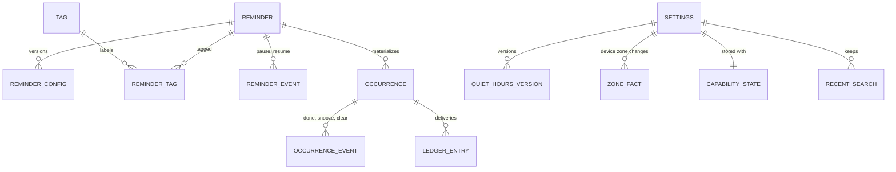
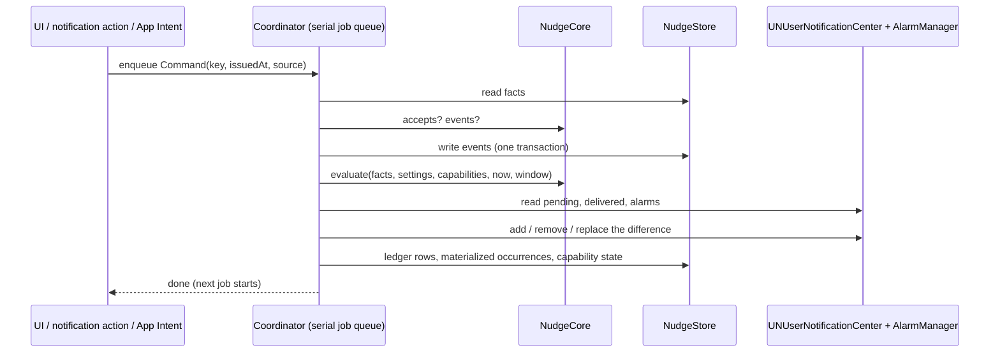

# Architecture Spine — Nudge-inator

Precedence is set once, in the [brief's introduction](../product/brief.md). Reasons for each decision are in
[.memlog.md](.memlog.md).

## Design Paradigm

**Functional core, imperative shell, with desired-state reconciliation.** No app code runs when a
notification or alarm fires, so nothing may depend on it. A pure engine computes, from stored facts
and a clock, everything that is true now and everything that should be scheduled. A reconciler
makes the system's pending notifications and alarms match that plan. Every change is a job on one
serial queue: a command writes facts, then a reconcile follows.

All code outside the app and widget targets lives in one Swift package, `NudgeKit`, so `package`
access can hide the store's write API from everything but the shell.

| Layer | Target (in `NudgeKit` unless noted) | Holds | May import |
|---|---|---|---|
| Core | `NudgeCore` | Domain types, the engine (`evaluate`, `accepts`, `prunable`, Siri order), `DeliveryID`, slot policy, export encoding, the `CommandSubmitting` and `NudgeQuerying` protocols | Foundation, CryptoKit |
| Store | `NudgeStore` | GRDB schema, migrations, read projections (public), write API (`package` only), command journal | NudgeCore, GRDB |
| Shell | `NudgeShell` | `Coordinator` (serial job queue, command handling, reconciler), notification and AlarmKit adapters, `Capabilities`, background refresh, notification delegate, Test Nudge | NudgeCore, NudgeStore, NudgeLiveActivity, UserNotifications, AlarmKit, BackgroundTasks, UIKit (AD-18) |
| Live Activity | `NudgeLiveActivity` | `NudgeAlarmMetadata`, the alarm's stop, snooze and Live Activity Done intents | NudgeCore, AppIntents, AlarmKit |
| Intents | `NudgeIntents` | Siri and App Shortcuts intents, App Entities and queries | NudgeCore, NudgeLiveActivity, AppIntents |
| UI | `Nudge-inator` app target | SwiftUI scenes and views, `NudgeModel`, Assistive Access | all of the above |
| Widget | `NudgeWidgets` extension | The alarm's countdown Live Activity view | NudgeLiveActivity, NudgeCore, ActivityKit, WidgetKit |



Every target may also import `os` for logging (AD-19).

## Invariants & Rules

### AD-1 — The engine is pure and is the only source of nudging rules [ADOPTED]

- **Binds:** brief §3–§4, How It Nudges, the plan, history, Siri answers, tests
- **Prevents:** the preview, the scheduler, the UI or Siri each encoding strengths, quiet hours, carry-over, give-up limits or the Siri order their own way
- **Rule:** `NudgeCore` exposes `evaluate(facts, settings, capabilities, now, window) -> Evaluation`, holding the derived state of every occurrence in the window, with its closing reason and nudges counted, the ordered desired delivery plan, and `nextChangeAt` (the next instant any derived state changes). It reads no clock, OS API or database; `now` and the device zone are parameters. `evaluate` is the only fold over facts. The live model and the reconciler pass the default window, from the start of yesterday in the current zone through the plan horizon (AD-14), which covers My Day, Last 24 Hours and Assistive Access. History and Export pass a 90-day window and a reminder filter. Any code that needs a nudge time, urgency, status, count, channel, Siri order or "is this command allowed" gets it from `NudgeCore`. How It Nudges is `evaluate` on the form's draft.

### AD-2 — Occurrence status is derived, never written by a timer [ADOPTED]

- **Binds:** Occurrence, My Day counts, history, Siri, Assistive Access
- **Prevents:** a status that's wrong because no code ran at the give-up limit or a takeover
- **Rule:** the store holds facts only. Coming up, nudging, done, missed and skipped are computed by the engine. So is a reminder's status (Active, Paused or Completed, brief §3): Paused comes from the latest pause or resume event and wins over Completed; Completed comes from an active one-off whose occurrence has closed and hasn't been reopened or given a new time. A Completed one-off accepts no pause. No stored column caches a status.

### AD-3 — Facts are immutable, versioned and carry their origin [ADOPTED]

- **Binds:** Edit while nudging (brief §3), quiet hours, time-zone changes, history, export
- **Prevents:** an edit, a quiet-hours change or a flight rewriting past statuses; history that can't say "Done (alarm stopped)"
- **Rule:**
  - **Events are append-only rows:** done, not done, snooze, clear, pause, resume and skip-by-edit. Each records `issuedAt` (when the person acted, from the surface), the occurrence key and nudge index, and `source` (`app`, `notification`, `alarm` (either of the alarm's buttons; the command kind says which), `alarmCountdown`, `liveActivity`, `siri`, `assistiveAccess`).
  - **Order:** every projection, the engine's fold, History and Export order events by `issuedAt`, then by commit sequence.
  - **Versioned facts carry the instant they were saved:** a reminder's nudging configuration (`ReminderConfig`: schedule, repeat rule, strength, snooze length, give-up limits, Ignore Quiet Hours), quiet hours, and the device time zone. The coordinator writes a zone fact when it detects a change.
  - **How versions apply:** the engine applies each version per brief §3. A new schedule applies from the next due time; strength, limit and Ignore Quiet Hours apply from the next nudge; a new snooze length applies from the next snooze. A version with a gentler strength already carries the raised snooze length and limit (brief §3), so the engine never sees a snooze length below the strength's default. Each past instant is evaluated with the quiet hours and zone in effect then.
  - **Mutable fields:** only title, notes and tags.
  - **Give-up time:** the time counted toward the limit leaves out the union of quiet, snoozed and closed intervals.

### AD-4 — One serial queue for every write and every scheduling change [ADOPTED]

- **Binds:** UI, notification delegate, every App Intent, background refresh, OS observers
- **Prevents:** racing commands, reconciles undoing each other, double closes, half-applied changes
- **Rule:**
  - **One queue:** the `Coordinator` in `NudgeShell` owns a single serial job queue (one consumer of an `AsyncStream`). Each job runs to completion, including its awaits, before the next starts. There are two job kinds.
  - **Command job:** `NudgeCore.accepts(command, facts, at: command.issuedAt)` decides whether the command applies. It judges the command against every committed fact as of its `issuedAt`, and rejects it if its occurrence already has a committed event with a later `issuedAt`, so a command never rewrites what came after it. Not Done applies to the latest done occurrence while brief §3's Not Done window is open. If the occurrence had already used its give-up limit, Not Done allows exactly one more nudge, one interval after reopening at the next step, delivered as its urgency would be, except that an Urgent one without alarms is a single `.timeSensitive` notification, not a chain (AD-13). It offers Done but no Snooze. Quiet hours hold it like any nudge, and the interval counts from its planned fire instant, whether or not it has a channel; if it's unanswered one interval after that, the occurrence closes as missed. If it applies, the job writes the rows `accepts` returns in one transaction. A command naming a valid projected occurrence key materializes it (AD-8). A command that doesn't apply writes nothing. Either way the job ends with a reconcile, so a stale action's delivered notification is cleared.
  - **The command set:** `NudgeCore` defines `Command` and every kind: the occurrence events (AD-3); creating, editing and deleting a reminder; creating, renaming and deleting a tag; quiet hours; Recent Searches; and Delete All Data. `accepts` returns every row the command writes (events, versions, tags, Recent Searches) and does the validation and uniqueness checks; database constraints are only a backstop. A version's saved instant is the command's `issuedAt`.
  - **Reconcile job:** triggers enqueue one, and several pending ones coalesce. A reconcile writes only bookkeeping: materialized occurrences, ledger rows, capability state, zone facts and pruning.
  - **Write access:** `NudgeStore`'s write API is `package` access, used only by the `Coordinator`. Views, intents and the widget can't write.

### AD-5 — The app process is the only process that opens the database [ADOPTED]

- **Binds:** NudgeIntents, NudgeLiveActivity, NudgeWidgets, NudgeStore
- **Prevents:** two processes writing one SQLite file
- **Rule:**
  - **Where intents run:** in the app process. The alarm's stop and secondary intents and the Live Activity's Done are `LiveActivityIntent`s; on iOS 27 they set `allowedExecutionTargets` to the main app (inside an AD-18 wrapper). Siri and App Shortcuts intents run in the app process. Notification actions run in the app's `UNUserNotificationCenterDelegate`.
  - **No coordinator, no effect:** an intent that finds no `CommandSubmitting` registered does nothing, so the occurrence keeps nudging. Whether iOS 26 ever runs these intents in the widget extension is settled by the first spike (Structural Seed › Device checklist).
  - **How intents reach the coordinator:** only through `CommandSubmitting` and `NudgeQuerying` (both `Sendable`, defined in `NudgeCore`). The app registers both with `AppDependencyManager` at launch.
  - **The widget:** links `NudgeLiveActivity` and `NudgeCore`, never `NudgeStore` or `NudgeShell`. It renders only from `AlarmAttributes<NudgeAlarmMetadata>`.
  - **Packaging:** every target that holds or uses intents declares an `AppIntentsPackage`.
  - **No shared container:** there is no App Group container for the database.

### AD-6 — Only the reconciler schedules, cancels or removes [ADOPTED]

- **Binds:** UNUserNotificationCenter, AlarmManager, delivered notifications
- **Prevents:** a view or intent scheduling something the plan doesn't contain, or leaving something the plan dropped
- **Rule:**
  - **What the plan holds:** deliveries whose fire instant is after `now`, plus an immediate delivery (the Done follow-up) that has no ledger row yet. Checking for that row is the reconciler's one ledger read.
  - **The diff:** the reconcile job evaluates, then diffs the plan against pending requests and `AlarmManager.alarms` only. It adds what's missing, removes what's extra and replaces what changed. A plan item is matched by delivery ID, and it changed if its fire instant, channel, interruption level, category or localized content (title and nudge line, as `previewsHidden` shapes them) differs. Delivered notifications are never added or replaced; only Cleanup removes them.
  - **Which command answers an alarm:** any committed event on the alarm's occurrence with `issuedAt` at or after the alarm's fire instant (its `.fixed` date). Commands carry no delivery ID, so this holds for every source.
  - **Alarms in progress:** an alarm that is alerting or counting down for an open occurrence is never removed as extra until a command that answers it has been committed.
  - **Uncounted snoozes:** an alarm for an open occurrence that the reconciler sees in AlarmKit's `.countdown` state after its fire instant is a system snooze whose intent never ran (a Snooze before the first unlock). The engine's own post-snooze alarm counts down before its fire instant (AD-12), so it never qualifies. The reconciler adopts it only if no `snooze` that answers it is committed or still waiting in the queue (AD-4), so an intent that runs late isn't counted twice. It commits a `snooze` command with `source: .alarmCountdown` and `issuedAt` set to the alarm's fire instant, so it counts toward the 3 snoozes and the later alarms move past it. Each alarm alerts at its own instant, so repeat snoozes of one nudge stay distinct. Snoozes before the first unlock count at most once per alarm, because the reconciler sees only the countdown running when it runs. An alarm that's no longer in `AlarmManager.alarms` is never adopted: Apple deletes an alarm once it fires and stops, so its absence can't tell a Stop, a ring-out or a finished snooze apart.
  - **Cleanup:** it removes delivered notifications whose occurrence is closed, expired Done follow-ups and delivered keep-nudging notices.
  - **Echoes:** `alarmUpdates` and `authorizationUpdates` that only echo the coordinator's last applied set are ignored.
  - **Triggers:**
    - launch and foreground
    - after every command
    - `BGAppRefreshTask`
    - significant time change and `NSSystemTimeZoneDidChange`
    - `NSCurrentLocaleDidChange`
    - AlarmKit `authorizationUpdates` and `alarmUpdates`
    - protected data becoming available
  - **Exceptions:** Send a Test Nudge posts `test/…` directly and writes no events or ledger rows; `test/…` is outside the reconciler's namespace and never removed by it. Before the first unlock, the stop intent posts `followup/<key>/<n>` itself (AD-16), under its planned ID; once the journal is replayed, the reconciler owns it like any other delivery.

### AD-7 — Deterministic, locale-independent identity [ADOPTED]

- **Binds:** engine, reconciler, ledger, intents, App Entities
- **Prevents:** two units naming the same nudge differently; IDs that change with region settings; an action that can't be traced to its occurrence
- **Rule:**
  - **Occurrence key:** `OccurrenceKey` is `<lowercase reminder UUID>@<yyyyMMdd'T'HHmm>`, the due wall-clock time (reminders have no zone of their own; AD-9). It uses the Gregorian calendar and ASCII digits, independent of locale.
  - **Delivery IDs:**
    - `nudge/<key>/<n>`
    - `chain/<key>/<UTC yyyyMMdd'T'HHmm of the chain's start>/<k>`
    - `snooze/<key>/<n>/<s>`
    - `followup/<key>/<n>`, where `n` is the stopped alarm's nudge index
    - `keep/<UTC yyyyMMdd'T'HHmm>`
    - `test/<UTC instant>`
  - **Never reused:** every delivery ID is unique for the life of its occurrence, so a restarted chain or a second Stop after Not Done gets new IDs. A test checks uniqueness over a full simulated occurrence with snoozes, chains and Not Done.
  - **AlarmKit IDs:** UUIDv5 (RFC 9562) of the delivery ID, in a namespace UUID that is a literal constant in `NudgeCore`, computed with CryptoKit's SHA-1.
  - **One owner:** only `NudgeCore.DeliveryID` builds and parses IDs, with round-trip tests. Every notification's `userInfo` and every alarm's metadata carry the occurrence key and nudge index; an alarm's metadata also carries the reminder's title (AD-16).
  - **DST:** a wall time that doesn't exist resolves forward by the gap; a repeated wall time resolves to its first instance.

### AD-8 — Occurrences materialize once, with a frozen instant [ADOPTED]

- **Binds:** Occurrence rows, follow-the-iPhone reminders, history, commands on unseen occurrences
- **Prevents:** a nudge ringing twice after a flight; Done dropped for an occurrence whose row doesn't exist yet
- **Rule:**
  - **Before it's written:** an occurrence is a projection, recomputed with the current zone.
  - **When it's written:** the coordinator writes its row the first time either of these happens:
    - a command names its key
    - a reconcile finds that it's due, or that its first planned delivery is in the past
  - **Its instant:** when the row is written, the due instant is frozen by resolving the key's wall time in the latest zone fact (AD-7's DST rule). It is never recomputed. A ledger row's fire instant is not the due instant: quiet hours can hold nudge 1 past it.

### AD-9 — Time zones: everything follows the iPhone

- **Binds:** engine, My Day, reconcile triggers
- **Prevents:** a unit using any zone other than the iPhone's current one
- **Rule:**
  - **One zone:** reminder times, quiet hours and My Day's "today" all use the iPhone's current time zone (brief §3, Reminder). `ReminderConfig` has no time zone field.
  - **On a zone change:** the coordinator records a zone fact and re-plans every projection.
  - **OS triggers are absolute:** notification triggers are non-repeating `UNCalendarNotificationTrigger`s built from UTC date components; alarms are `Alarm.Schedule.fixed`. No request uses a repeating, wall-clock or relative trigger.

### AD-10 — Repeat rules are a closed type that matches the form

- **Binds:** ReminderConfig, engine, New/Edit form, export
- **Prevents:** an engine that has to support rules no one can enter, and a "Keep: …" state with no source
- **Rule:**
  - **The type:** `RepeatRule` is an enum: `never`, the presets (every day, every weekday, every week, every 2 weeks, every month, every year) and `custom(frequency, interval, weekdays, timesOfDay)`.
  - **Times of day:** `timesOfDay` is a sorted, de-duplicated list of one or more local times. The first is the start's own time.
  - **Month ends:** a monthly rule on a day the month doesn't have (29th–31st) falls on that month's last day, and a yearly rule on 29 February falls on 28 February in other years. It never skips a month or year. The form's Repeat summary and How It Nudges use the same rule.
  - **Closed set:** every value the type can hold is editable in the form. No other recurrence format is parsed or stored.

### AD-11 — Delivery channels and the "alarms unavailable" fallback

- **Binds:** engine plan, adapters, Via labels
- **Prevents:** iOS 18 and a denied alarm permission taking different paths, or a channel decided outside the engine
- **Rule:**
  - **Who decides:** the engine picks each delivery's channel from `Capabilities`. The canonical fields are `notificationsAllowed`, `timeSensitiveAllowed`, `alarmsAvailable`, `alarmCapacity` and `previewsHidden`.
  - **Time Sensitive off:** every `.timeSensitive` delivery in this spine is sent as `.active` when `timeSensitiveAllowed` is false (brief §4). This is the only place the spine states it.
  - **Normal:** an `.active` notification.
  - **High:** a `.timeSensitive` notification.
  - **Urgent:** an AlarmKit alarm when `alarmsAvailable`; otherwise the notification chain (AD-13). `alarmsAvailable` is false on iOS 18 and whenever AlarmKit authorization isn't `.authorized`. When AlarmKit is available, authorization is `.notDetermined` and the onboarding-done flag is set (an iPhone updated from iOS 18), the shell asks once on launch; otherwise onboarding asks (EXPERIENCE › State Patterns › Any). The one extra nudge after Not Done at the limit is the exception to the chain fallback (AD-4).
  - **Past the alarm limit:** Urgent nudges beyond `alarmCapacity` come as one `.timeSensitive` notification each.

### AD-12 — Snooze and Stop are commands; the engine plans what follows

- **Binds:** alarm intents, engine, reconciler
- **Prevents:** an intent scheduling behind the reconciler's back; an alarm ringing for a closed occurrence or during quiet hours
- **Rule:**
  - **Intents only submit commands:** the alarm's snooze and stop intents submit `snooze` and `done(source: .alarm)` and touch no OS API, except as in AD-16.
  - **What the engine plans:**
    - **The post-snooze alarm,** `snooze/<key>/<n>/<s>`. It's an `Alarm.Schedule.fixed` alarm (AD-9) with a pre-alert countdown, so the Live Activity shows before it fires. It has no secondary button when no snoozes remain. It's moved, or dropped, if the snooze would end after a takeover or inside quiet hours for a reminder that doesn't ignore them.
    - **The later alarms,** moved past the snooze.
    - **The follow-up after Stop:** `followup/<key>/<n>` from a `done(source: .alarm)` event, sent at once.
  - **Every alarm's configuration:** its attributes carry the alert and countdown presentations (iOS draws the countdown itself before the first unlock), and its `postAlert` is the reminder's snooze length.
  - **The system's countdown:** the reconciler cancels it, because AD-6 lets it remove that alarm once the snooze command is committed.
  - **Fallback:** if a device shows that cancelling during a countdown fails, the snooze button switches to `.custom` behavior: the intent runs and the engine's alarm replaces the countdown.

### AD-13 — Notification chain semantics

- **Binds:** engine plan for Urgent when alarms are unavailable
- **Prevents:** duplicate notifications in one minute and nudge counts that differ by OS
- **Rule:**
  - **When a chain starts:** each time an occurrence enters or re-enters Urgent, as listed in brief §4 (the one list, including its exception for the extra nudge after Not Done at the limit, AD-4).
  - **What it sends:** a `.timeSensitive` notification at once and every minute after, 10 in all. Each one's nudge index is the nudge number it shows, taken from the plan item, never parsed from its ID. It ends early when brief §4 says, and whenever the occurrence closes (brief §4, Closing an occurrence clears its nudges).
  - **Nudges inside it:** the strength's Urgent nudges that fall inside a running chain still count on schedule but aren't sent separately. The chain notification at that minute shows the current nudge number.
  - **Limits:** chain repeats don't count toward the nudge limit, but their time counts toward the time limit.

### AD-14 — Slot budgets, horizon and cost [ADOPTED]

- **Binds:** engine plan, reconciler, background refresh
- **Prevents:** iOS silently dropping a first nudge; a plan that grows without bound
- **Rule:**
  - **Horizon:** the plan covers 8 days ahead, or until the budgets are full, whichever comes first.
  - **Notification order:**
    1. nudge 1 of every coming-up occurrence, soonest first
    2. every other delivery, soonest first

    The plan is cut to 63 requests, plus 1 keep-nudging request at the fire time of the first delivery left out, whether the budget or the horizon cut it.
  - **Alarms:** soonest first, up to `alarmCapacity`, which starts unknown (no limit). When AlarmKit throws `maximumLimitReached`, the reconciler persists the number that succeeded as `alarmCapacity`, then re-evaluates and re-diffs in the same job, so the overflow becomes notifications at once. A later reconcile tries one more alarm only when the plan wants more than `alarmCapacity`.
  - **Background refresh:** each reconcile requests a `BGAppRefreshTask` for the plan's earliest top-up time, and no later than 12 hours ahead.
  - **What `evaluate` reads:** current and future versions, the facts in its window (AD-1), and each reminder's latest occurrence before the window with the facts since then (for carry-over and Not Done).
  - **Cost:** an evaluate with the default window stays under 50 ms for 200 reminders on the oldest iPhone that runs iOS 18. A benchmark test holds it under 50 ms on the CI simulator, which only catches regressions; the device checklist confirms it on that iPhone.

### AD-15 — The ledger records what was handed over, and what was lost

- **Binds:** history, export, restore detection
- **Prevents:** history claiming a nudge was sent when it never was
- **Rule:**
  - **What's recorded:** every delivery the reconciler schedules gets a ledger row with its delivery ID, occurrence key, nudge index, urgency, channel, fire instant and `handedOverAt`, set once the OS accepts the request. A planned nudge with no channel (notifications off, and no alarm for it) gets a row with channel `none`, and nothing is handed to the OS for it; it still counts toward the give-up limit (brief §4). Before a row's fire instant, a permission change replans it like any other change. Every chain notification gets its own row, like any delivery, so lost and restore detection work the same for chains.
  - **States:**
    - `scheduled`
    - `cancelled`: the reconciler removed it before its fire instant
    - `lost`: it vanished from the OS before its fire instant without the reconciler removing it
  - **History's nudge lines:** the nudges `evaluate` counted (AD-1), joined to ledger rows by nudge index, one line per nudge index (a chain's rows share one). A counted nudge past its instant reads as sent through the channel of its row that was handed over and isn't `cancelled` or `lost`. With a channel-`none` row instead, it couldn't be sent because notifications were off. With neither (cut by the budget, never handed over, or lost), it couldn't be sent because the app wasn't opened. Export uses the same lines.
  - **Restore detection:** a marker file beside the database, excluded from backups (`isExcludedFromBackup`, set again each time it's written). A database with no marker was restored, from this iPhone's backup or another's, so every future `scheduled` row is marked `lost` and the plan is rebuilt; then the marker is written.
  - **Pruning:** facts and rows older than 90 days are pruned only where `NudgeCore.prunable` says they're inert. Reminder-level state (pause, current versions) and each reminder's latest occurrence with its facts are never prunable.

### AD-16 — Persistence: GRDB, one protected file, a journal for before the first unlock

- **Binds:** NudgeStore, Lock Screen and alarm intents
- **Prevents:** schema drift between versions; a Stop or Done lost because it came before the first unlock
- **Rule:**
  - **The database:** one SQLite database through GRDB, in its own folder in Application Support. The folder has file protection `completeUntilFirstUserAuthentication`, so the `-wal` and `-shm` files match. It's included in iCloud and computer backups.
  - **Migrations:** only through numbered `DatabaseMigrator` migrations, each covered by a test that migrates a fixture from the previous version.
  - **The journal:** while protected data is unavailable (before the first unlock), a command goes to an append-only journal file with protection `none`. It holds only the command kind, occurrence key, nudge index, `source` and `issuedAt`, never titles. If the command is a Stop, the intent also posts `followup/<key>/<n>`, taking the reminder's title from the alarm's `NudgeAlarmMetadata` (the alarm already shows the title, so this exposes nothing new), so the follow-up reads as EXPERIENCE gives it. On the first open, the journal is replayed in order before any reconcile runs, writing a ledger row for each follow-up the intent posted, then deleted, so a reconcile never sees a journaled command as missing (AD-6). If the stop intent itself doesn't run before the first unlock (Apple documents this only for the secondary intent), the Stop isn't recorded: the alarm leaves `AlarmManager.alarms`, which AD-6 never reads as a command, and the occurrence keeps nudging.
  - **Any other open failure** (a failed migration, corruption): it's logged, nothing is journaled, and the coordinator runs no jobs, so what's already scheduled is left alone. The app shows the message in EXPERIENCE › State Patterns › Any.
  - **Delete All Data:** deletes every reminder, tag, occurrence, event, ledger row and Recent Search, and the journal, in one job, then reconciles to an empty plan. The tag filters turn off as Conventions › UI state says. It keeps settings (quiet hours and their versions, zone facts and capability state) and the `UserDefaults` flags, as brief §3 says.

### AD-17 — Lock Screen actions and Siri need no authentication

- **Binds:** notification categories, alarm and Siri intents
- **Prevents:** Done asking for Face ID on one surface and not another
- **Rule:**
  - **Categories:**
    - `nudge`: Done and Snooze
    - `nudge-final`: Done only
    - `followup`: Not Done
  - **No authentication:** no action is `.authenticationRequired` or `.foreground`, and no Siri intent needs authentication.
  - **Clear:** `nudge` and `nudge-final` set `customDismissAction`. Recording a Clear is best effort: iOS reports only an explicit Clear.
  - **Taps:** tapping a nudge opens Now at its occurrence; tapping a follow-up opens the reminder.

### AD-18 — The OS split lives in the shell and in named wrappers

- **Binds:** NudgeShell, NudgeLiveActivity, NudgeWidgets, view modifiers, Assistive Access
- **Prevents:** `#available` checks scattered through views and the engine
- **Rule:**
  - **The engine:** `NudgeCore` never checks the OS. `Capabilities` (AD-11) is built in `NudgeShell`.
  - **AlarmKit and the alarm Live Activity (iOS 26+):** `NudgeShell` uses AlarmKit only inside its AlarmKit adapter, behind `@available(iOS 26, *)`. Every type in `NudgeLiveActivity`, and the widget's alarm Live Activity, is `@available(iOS 26, *)`.
  - **Other iOS 26-only APIs:** used only inside named wrappers in the app target:
    - `tabBarMinimizeBehavior`
    - `navigationSubtitle`
    - the `AssistiveAccess` scene, as an `if #available` in the scene body (iOS 18 behavior: EXPERIENCE › Assistive Access)

    `Tab(role: .search)` is iOS 18+ and is used directly. iOS 27-only APIs, such as `allowedExecutionTargets` (AD-5), sit behind `@available(iOS 27, *)` where they're declared.
  - **UIKit:** used only for the app lifecycle (the `UIApplicationDelegateAdaptor` in the app target; the `UIApplication` notifications and the Settings URL in `NudgeShell`), `UIAccessibility.isAssistiveAccessEnabled`, and `UITabBarAppearance` on iOS 18.
  - **Layout:** decided by width and size class, never by device idiom or interface orientation. "Landscape" in the spines means compact vertical size class.

### AD-19 — Privacy floor

- **Binds:** notifications, alarms, logging, journal, export, dependencies
- **Prevents:** notes or tags leaking off the app's own screens; telemetry creeping in
- **Rule:**
  - **On system surfaces:** notification and alarm content carries only the title and the nudge line. Notes and tags appear only in the app's views and Export Data.
  - **Logging:** `os.Logger`, with titles, notes and tag names marked `.private`.
  - **Personal text:** the journal and `UserDefaults` hold none.
  - **Dependencies:** no network calls, analytics or third-party SDKs. GRDB is the only dependency.

### AD-20 — One live model for the open app

- **Binds:** every screen, the Now badge, VoiceOver announcements, Assistive Access
- **Prevents:** screens refreshing statuses at different moments; missed announcements because nothing was written when a nudge started
- **Rule:**
  - **One model:** a single app-wide `@Observable NudgeModel` holds the latest `Evaluation`. Views read derived state only from it.
  - **Same inputs as the reconciler:** `NudgeModel` evaluates only from the inputs the coordinator last published (facts, settings, the latest zone fact and the persisted capabilities), changing nothing but `now`. A zone or permission change reaches the screens through a reconcile.
  - **When it refreshes:**
    - on store change
    - on foreground
    - at the evaluation's `nextChangeAt`
  - **Announcements:** the VoiceOver announcements in EXPERIENCE.md (a nudge starts, a card closes) come from diffing successive evaluations.
  - **Banners over the app:** `willPresent` shows nudges as banners with sound while the app is open.

## Consistency Conventions

| Concern | Convention |
| --- | --- |
| Naming | Domain types use the brief's words: `Reminder`, `ReminderConfig`, `Occurrence`, `Nudge`, `Strength`, `Urgency`, `Tag`, `QuietHours`, `GiveUpLimit`, `Snooze`. Never "alert level", "ping", "dismiss". |
| IDs | Reminders and tags: UUID. Occurrences and deliveries: AD-7. |
| Time | Instants stored as UTC `Date`. Wall-clock values as a `LocalDateTime`, read in the iPhone's current zone (AD-9). All date math in `NudgeCore` through an injected Gregorian `Calendar`. |
| Durations | Integer seconds in the model and engine (brief §3 has 7.5- and 2.5-minute intervals); `TimeInterval` only at the OS adapters. |
| Clock | One `Clock` protocol injected into the shell; `NudgeCore` takes `now` as a parameter. |
| Errors | Adapter failures are logged and fold into `Capabilities`; they never surface as raw errors in UI. User-visible states are the spines' banners and Via labels. |
| Tags | A tag's unique key is its name case-folded with Foundation (`.caseInsensitive`, no locale), stored in its own indexed column; never SQLite `NOCASE`. |
| Strings | Every user-facing string, including notification, alarm, Live Activity, App Shortcut and accessibility text, is in a String Catalog with plural variants and positional arguments. The widget extension has its own catalog. Notification content is localized when scheduled. |
| Formats | Dates, times and durations shown to people use the system formatters; IDs and export use fixed POSIX formats. |
| UI state | Navigation per tab with `NavigationStack`. My Day's filter, match mode and chosen count, and the Tags tab's tokens and match mode, use `SceneStorage`. A tag filter is `off`, `tags(IDs, match)` or `noTags` (My Day only). Tag IDs that no longer exist are dropped whenever a `tags` filter is read, so deleting a tag or all data empties it in every scene (each scene has its own `SceneStorage`), and a `tags` filter with no tags left is off. Delete All Data also turns a `noTags` filter off in the scene it runs in. Recent Searches live in the database. Non-personal flags (onboarding done, banners acknowledged) live in `UserDefaults`. |
| Siri | "The first" nudging reminder is `NudgeCore`'s order: highest urgency, then earliest due, then most nudges sent. |
| Testing | `NudgeCore` and `NudgeStore` tests use Swift Testing with a fixed clock and fixed zones, including DST transitions, zone changes mid-occurrence and the 50 ms benchmark. UI tests use XCTest. Every test, `NudgeKit`'s included, runs with `xcodebuild test` on the iOS 18 and 26/27 simulators; there is no macOS test run, because AlarmKit, ActivityKit and `BGTaskScheduler` have no macOS. |
| Export | JSON, `schemaVersion: 1`, ISO 8601 instants with offsets, IANA zone IDs, tags by name, reminders with their versions, occurrences with their statuses, events, and History's nudge lines (AD-15). File `nudge-inator-YYYY-MM-DD.json`. Not importable. |

## Stack

| Name | Version |
| --- | --- |
| Xcode | 27.0 (27A266a) |
| Swift (language mode 6) | 6.4 |
| iOS deployment target | 18.0 |
| SwiftUI, UserNotifications, App Intents, BackgroundTasks, CryptoKit | iOS 18 SDK surface |
| AlarmKit, ActivityKit (alarm Live Activity), AssistiveAccess scene | iOS 26.0+ |
| GRDB.swift | 7.11.1 |
| Swift Testing / XCTest | bundled with Xcode 27.0 |

## Structural Seed






```text
nudge-inator/
  App/                         # Nudge-inator app target: scenes, views, NudgeModel, Info.plist, String Catalog
  Widgets/                     # NudgeWidgets extension: alarm Live Activity view, its String Catalog
  Packages/NudgeKit/
    Sources/NudgeCore/         # pure engine and domain
    Sources/NudgeStore/        # GRDB schema, migrations, projections, journal
    Sources/NudgeShell/        # Coordinator, reconciler, OS adapters, capabilities
    Sources/NudgeLiveActivity/ # alarm metadata and Live Activity intents
    Sources/NudgeIntents/      # Siri and App Shortcuts intents, entities
    Tests/
  .github/workflows/ci.yml     # engine tests and simulator tests on PRs
```

**Environments.**
- **Builds:** Debug builds run on simulators and devices.
- **TestFlight:** internal testing is the owner; external testers go through Beta App Review on the first build of each version.
- **App Store:** once brief §8 is met. Builds are archived and uploaded from Xcode's Organizer.
- **Entitlements and keys:**
  - Time Sensitive Notifications
  - `NSAlarmKitUsageDescription`
  - `NSSupportsLiveActivities`
  - `UISupportsAssistiveAccess`
  - `UISupportsFullScreenInAssistiveAccess`
  - `UIBackgroundModes` with `fetch`
  - `BGTaskSchedulerPermittedIdentifiers`
  - `ITSAppUsesNonExemptEncryption = NO`
  - `PrivacyInfo.xcprivacy` in the app target: no tracking, no collected data, and `UserDefaults` declared with reason `CA92.1`. GRDB 7.11.1 ships its own manifest, which declares no required-reason APIs.
  - App Store privacy label: Data Not Collected (AD-19)
- **CI:** the workflow names a runner image that has Xcode 27.0 (not every macOS image does) and downloads the iOS 18 simulator runtime (`xcodebuild -downloadPlatform iOS -buildVersion 18.x`). Its first run confirms GRDB's UI tests on the Xcode 27.0 simulator (GRDB issue #1875, a UI-test crash on Xcode 27 beta 4, closed without a named fix).
- **Infrastructure:** there is no server and no runtime infrastructure.

**First spike:** App Intents declared in `NudgeKit` targets and used from both the app and the widget, with an `AppIntentsPackage` in each. If that fails, the fallback is a framework target. The spike also records which process runs `NudgeLiveActivity`'s intents on iOS 26 and 27, with the app running and with it not running (WWDC26 session 345 says intents in a shared package may run in the extension when the app isn't running).

**Device checklist** (not automatable): the one list is in
[brief §10 › Device checklist](../product/brief.md#10-risks-and-decisions). These checks can change a
decision here:

| Check | If it fails |
| --- | --- |
| The AlarmKit limit | If it's very low, revisit how AD-11 and AD-14 budget alarms. |
| Cancelling an alarm during its countdown, and reusing alarm IDs | Switch to AD-12's `.custom` fallback. |
| Stop and Snooze after a force-quit | Revisit AD-12's intents-only-submit rule. |
| Stop, Snooze and Done before the first unlock | Revisit AD-16's journal. |
| Which process runs the alarm intents on iOS 26 (first spike) | Choose a fallback for AD-5. |
| The 64-notification limit | Change AD-14's budget. |
| Restoring from a backup | Revisit AD-15's restore detection. |
| The engine's speed on the oldest iOS 18 iPhone | Revisit AD-14's horizon or cost. |

## Capability → Architecture Map

| Capability / Area | Lives in | Governed by |
| --- | --- | --- |
| Strengths, urgency, give-up, quiet hours, carry-over, takeover, Pause, Not Done (brief §3) | NudgeCore engine | AD-1, AD-2, AD-3 |
| Delivery and fallbacks, iOS 18 chain (brief §4) | NudgeCore plan, NudgeShell adapters | AD-11, AD-13, AD-14 |
| System limits, plan horizon (brief §4, §11 Q4) | NudgeCore slot policy, Coordinator | AD-14 |
| Done, Snooze, Clear from notifications, alarms, Live Activity, Siri (brief §11 Q5, Q13) | Intents and delegate → Coordinator | AD-4, AD-5, AD-12, AD-17 |
| Closing clears nudges, stale actions (brief §11 Q11) | Coordinator, reconciler | AD-6, AD-4, AD-8 |
| Live Activity setup and reconciling with AlarmKit (brief §11 Q6) | NudgeLiveActivity, NudgeWidgets, reconciler | AD-5, AD-6, AD-12 |
| Time zones (brief §11 Q7) | Zone facts, triggers | AD-9, AD-8 |
| Storage and migration (brief §11 Q2) | NudgeStore | AD-16, AD-3 |
| History (90 days), Export Data (brief §11 Q12) | NudgeCore `evaluate` (90-day window) + ledger rows; NudgeCore export | AD-1, AD-15, Conventions › Export |
| How It Nudges preview (brief §11 Q3) | NudgeCore `evaluate` on the draft | AD-1 |
| iOS 18 vs 26/27 split, layout (brief §11 Q1, Q8) | NudgeShell Capabilities, app wrappers | AD-18, AD-11 |
| Live updates, badge, VoiceOver announcements | NudgeModel | AD-20 |
| Siri answers and order | NudgeIntents via `NudgeQuerying` | AD-5, AD-1, Conventions › Siri |
| Assistive Access | App target scene (iOS 26) / full-screen view (iOS 18) | AD-18, AD-20, AD-4 |
| Send a Test Nudge | NudgeShell | AD-6 exception |
| Delete All Data, Recent Searches | NudgeStore | AD-16, Conventions › UI state |
| Localization (brief §11 Q9) | String Catalogs in app and widget | Conventions › Strings |
| Testing on 18/26/27 (brief §11 Q10) | Swift Testing, XCTest, CI, device checklist | Conventions › Testing |
| Filters across relaunch (brief §11 Q14) | SceneStorage | Conventions › UI state |
| Privacy | All targets | AD-19 |

## Deferred

- **Out of scope for v1 (brief §6):** the iPad layout, sync, accounts, import, a Watch app and Home Screen widgets. The paradigm doesn't block any of them. Sync would need a conflict model for AD-3's facts.
- **iOS 27 `appEntityIdentifier` on alarms:** still marked beta in Apple's docs on 2026-10-03. Adopt it when final, as an optional link to the Occurrence entity.
- **iOS 27 `.clock` App Intents domain:** not adopted. It requires every schema in the domain, including creating alarms.
- **View structure below `NudgeModel`:** left to feature work. AD-1, AD-4, AD-18 and AD-20 constrain it.
- **Exact GRDB table and column names:** owned by the first migration.
- **Encryption at rest beyond iOS data protection (SQLCipher):** not needed for v1.
- **Release automation (fastlane, Xcode Cloud):** manual Organizer uploads until the TestFlight cadence needs more.
- **Device-only unknowns:** the checks in Structural Seed › Device checklist, each with what it would change. One is the first spike: whether iOS 26 runs the alarm and Live Activity intents in the widget extension when the app isn't running (AD-5).
