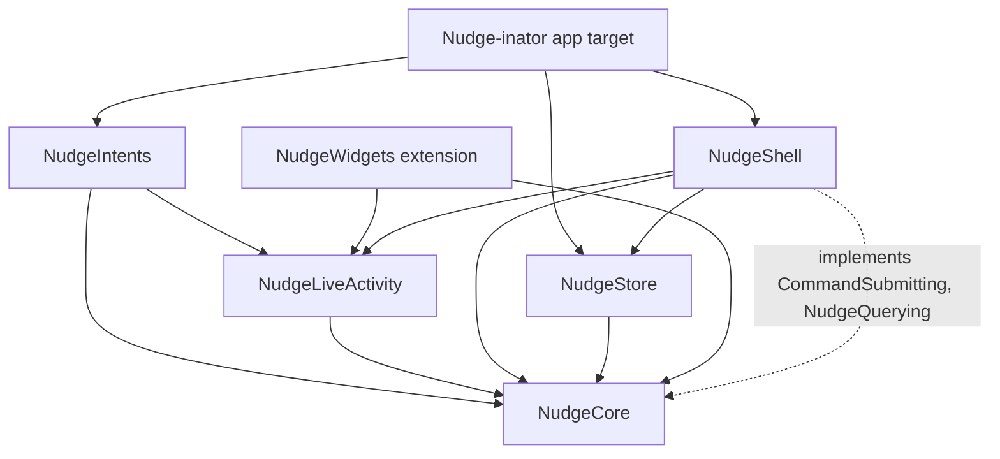
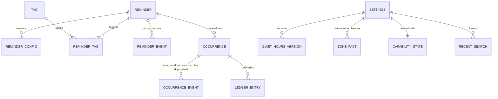
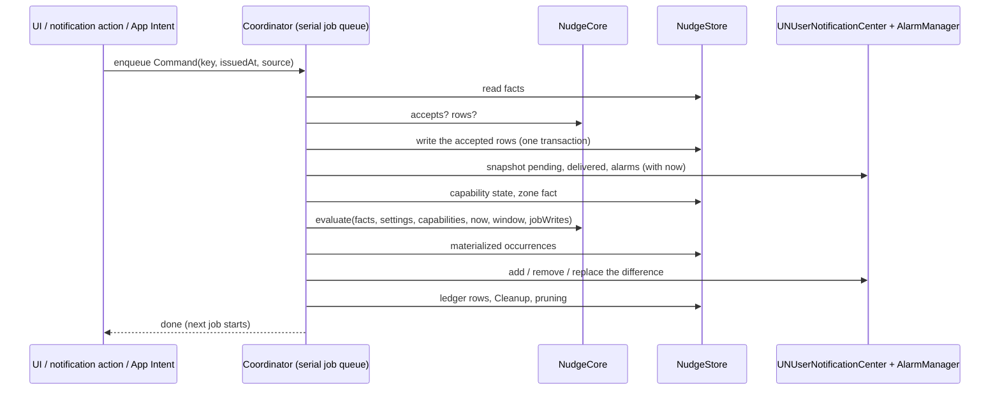
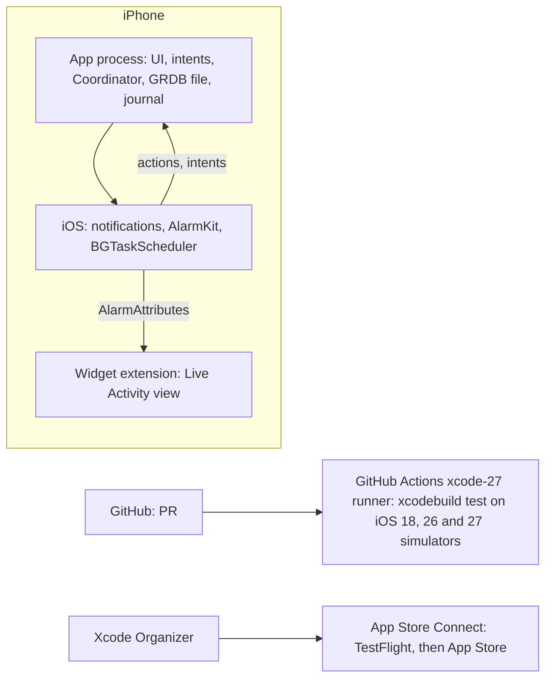

# Architecture Spine — Nudge-inator

Precedence is set once, in the [brief's introduction](../product/brief.md). Reasons for each decision are in
[.memlog.md](.memlog.md).

## Design Paradigm

**Functional core, imperative shell, with desired-state reconciliation.** No app code runs when a
notification or alarm fires, so nothing may depend on it. A pure engine computes, from stored facts
and a clock, everything that is true now and everything that should be scheduled. A reconciler
makes the system's pending notifications and alarms match that plan. Every change is a job on one
serial queue: a command writes facts, then a reconcile follows (a reconcile records only zone facts, AD-4).

All code outside the app and widget targets lives in one Swift package, `NudgeKit`, so `package`
access can hide the store's write API from everything but the shell.

| Layer | Target (in `NudgeKit` unless noted) | Holds | May import |
|---|---|---|---|
| Core | `NudgeCore` | Domain types, `Command`, the `Capabilities` and `Clock` types, the engine (`evaluate`, `accepts`, `prunable`, which event answers an alarm, Siri order, the search matcher), `DeliveryID`, slot policy, export encoding, the `CommandSubmitting` and `NudgeQuerying` protocols | Foundation, CryptoKit |
| Store | `NudgeStore` | GRDB schema, migrations, read projections (public), write API (`package` only), command journal | NudgeCore, GRDB |
| Shell | `NudgeShell` | `Coordinator` (serial job queue, command handling, reconciler), notification and AlarmKit adapters, building `Capabilities`, background refresh, notification delegate, Test Nudge | NudgeCore, NudgeStore, NudgeLiveActivity, UserNotifications, AlarmKit, BackgroundTasks, UIKit (AD-18), SwiftUI (for AlarmKit's `Color` tint only) |
| Live Activity | `NudgeLiveActivity` | `NudgeAlarmMetadata`, the alarm's stop, snooze and Live Activity Done intents | NudgeCore, AppIntents, AlarmKit, SwiftUI (for `AlarmAttributes`) |
| Intents | `NudgeIntents` | Siri and App Shortcuts intents, App Entities and queries | NudgeCore, NudgeLiveActivity, AppIntents |
| UI | `Nudge-inator` app target | SwiftUI scenes and views, `NudgeModel`, Assistive Access | all of the above, plus Accessibility |
| Widget | `NudgeWidgets` extension | The alarm's countdown Live Activity view | NudgeLiveActivity, NudgeCore, AlarmKit, ActivityKit, WidgetKit |



Every target may also import `os` for logging (AD-19).

## Invariants & Rules

### AD-1 — The engine is pure and is the only source of nudging rules [ADOPTED]

- **Binds:** brief §3–§4, How It Nudges, the plan, history, Siri answers, tests
- **Prevents:** the preview, the scheduler, the UI or Siri each encoding strengths, quiet hours, carry-over, give-up limits or the Siri order their own way
- **Rule:** `NudgeCore` exposes `evaluate(facts, settings, capabilities, now, window, jobWrites) -> Evaluation`, where `jobWrites` are the instants of writes committed in the current job (AD-6's at-once rule), holding the derived state of every occurrence in the window, with its closing reason and nudges counted, and per reminder its status (AD-2), its next due time (even past the window), whether carry-over is pending, and its latest done occurrence with `notDoneUntil` (nil once Not Done no longer applies), whatever the window, the ordered desired delivery plan, and `nextChangeAt` (the next instant any derived state changes). It reads no clock, OS API or database; `now` and the zone facts are parameters. `evaluate` is the only fold over facts. The live model and the reconciler pass the default window, from the start of yesterday (in the latest zone fact's zone) through 8 days after `now`, which covers Now (Nudging, Coming Up, Last 24 Hours), My Day and Assistive Access. An occurrence is in the window if it's due in it, or is open or can still take Not Done at any instant in it, so one reopened days later is planned and shown; the 63-request budget (AD-14) cuts only the delivery plan, never the derived states. History and Export call it through `NudgeQuerying` with the coordinator's published inputs, a 90-day window and a reminder filter. Any code that needs a nudge time, urgency, status, count, channel, Siri order or "is this command allowed" gets it from `NudgeCore`. How It Nudges is `evaluate` on the form's draft, with the reminder's own facts (none for a new one), the current settings and published capabilities, as if the draft were saved at `now`.

### AD-2 — Occurrence status is derived, never written by a timer [ADOPTED]

- **Binds:** Occurrence, My Day counts, history, Siri, Assistive Access
- **Prevents:** a status that's wrong because no code ran at the give-up limit or a takeover
- **Rule:** the store holds facts only. Coming up, nudging, done, missed and skipped are computed by the engine. So is a reminder's status (Active, Paused or Completed), by brief §3's Completed row, from its pause and resume events and its occurrences. No stored column caches a status.

### AD-3 — Facts are immutable, versioned and carry their origin [ADOPTED]

- **Binds:** Edit while nudging (brief §3), quiet hours, time-zone changes, history, export
- **Prevents:** an edit, a quiet-hours change or a flight rewriting past statuses; history that can't say "Done (alarm stopped)"
- **Rule:**
  - **Events are append-only rows:** done, not done, snooze, clear, pause, resume and skip-by-edit. Each records `issuedAt`, stamped by `CommandSubmitting.submit` from the shell's injected `Clock` when it's called (never earlier than the latest committed event's, so setting the clock back can't make `accepts` reject a new command), which every handler (delegate method, intent `perform`, view action) does first; journal replay keeps the entry's, and an adopted snooze takes the reconcile's `now`; the occurrence key, the nudge index the surface showed (for History only; the engine derives which nudge an event answers from `issuedAt`), and `source` (`app`, `notification`, `alarm` (either of the alarm's buttons; the command kind says which), `alarmCountdown`, `liveActivity`, `siri`, `assistiveAccess`).
  - **Order:** every projection, the engine's fold, History and Export order events by `issuedAt`, then by commit sequence.
  - **Versioned facts carry the instant they were saved:** a reminder's nudging configuration (`ReminderConfig`: schedule, repeat rule, strength, snooze length, give-up limits, Ignore Quiet Hours), quiet hours, and the device time zone. The coordinator writes a zone fact when it detects a change.
  - **How versions apply:** as brief §3's Edit row says. A version with a gentler strength is saved already carrying the raised snooze length and limit, so the engine never sees a snooze length below the strength's default or a limit below its minimum. Each past instant is evaluated with the quiet hours and zone in effect then.
  - **Mutable fields:** among a reminder's facts, only title, notes and tags. Tag names (Rename Tag) and Recent Searches are not facts.
  - **Deletion:** deleting a reminder deletes its versions, occurrences, events and ledger rows in one job; deleting a tag deletes it and its links to reminders. With Delete All Data (AD-16), these are the only removals of facts besides pruning (AD-15).
  - **Give-up time:** the time counted toward the limit leaves out the union of quiet, snoozed and closed intervals.

### AD-4 — One serial queue for every write and every scheduling change [ADOPTED]

- **Binds:** UI, notification delegate, every App Intent, background refresh, OS observers
- **Prevents:** racing commands, reconciles undoing each other, double closes, half-applied changes
- **Rule:**
  - **One queue:** the `Coordinator` in `NudgeShell` owns a single serial job queue (one consumer of an `AsyncStream`). Each job runs to completion, including its awaits, before the next starts. There are two job kinds, plus the journal replay that runs first once the store opens (AD-16).
  - **Command job:** `NudgeCore.accepts(command, facts, at: command.issuedAt)` decides whether the command applies. It judges the command against every committed fact as of its `issuedAt`, and rejects it if its occurrence already has a committed event other than a Clear (which changes nothing), or its reminder a committed pause or resume, with a later `issuedAt`, so a command never rewrites what came after it. A `snooze` is also rejected when the occurrence has no snoozes left or it answers the extra nudge after Not Done (brief §3), or if a committed snooze already answers the same delivered nudge (the latest nudge `evaluate` counted at or before its `issuedAt`, whatever its channel; ledger rows aren't an input to `accepts`), so one tap can't count twice. Not Done applies as brief §3 says, including the one extra nudge after Not Done at the limit. That nudge's interval counts from its planned fire instant, whether or not it has a channel. If it applies, the job writes the rows `accepts` returns in one transaction. A command naming a valid projected occurrence key materializes it (AD-8), only when `accepts` accepts it. A command that doesn't apply writes nothing. Either way the job ends with a reconcile, so a stale action's delivered notification is cleared.
  - **The command set:** `NudgeCore` defines `Command` and every kind: the occurrence events (AD-3); creating, editing and deleting a reminder; creating, renaming and deleting a tag; quiet hours; Recent Searches; and Delete All Data. `accepts` returns the command's whole write set, inserts, updates and deletes (events, versions, tags, title and notes edits, a deletion's cascade, Recent Searches trimmed to 5), and does the validation and uniqueness checks; database constraints are only a backstop. The form's duplicate-tag check is `accepts` with the Tags convention's key, not the search matcher. A version's saved instant is the command's `issuedAt`. One user gesture is one command: a form's Save carries the reminder with any new tags it names, Resume with a new time is one command, and nothing is written for a form that's discarded.
  - **Reconcile job:** triggers enqueue one, and several pending ones coalesce. A reconcile writes only bookkeeping: materialized occurrences, ledger rows, capability state, zone facts and pruning. The one command it creates is an adopted `snooze` (AD-6), which it enqueues like any other.
  - **Write access:** `NudgeStore`'s write API is `package` access, used only by the `Coordinator`. Views, intents and the widget can't write.

### AD-5 — The app process is the only process that opens the database [ADOPTED]

- **Binds:** NudgeIntents, NudgeLiveActivity, NudgeWidgets, NudgeStore
- **Prevents:** two processes writing one SQLite file
- **Rule:**
  - **Where intents run:** in the app process. The alarm's stop and secondary intents and the Live Activity's Done are `LiveActivityIntent`s; on iOS 27 they set `allowedExecutionTargets` to the main app (inside an AD-18 wrapper). Siri and App Shortcuts intents run in the app process. Notification actions run in the app's `UNUserNotificationCenterDelegate`.
  - **At launch:** the `UIApplicationDelegateAdaptor`'s `application(_:willFinishLaunchingWithOptions:)` creates the `Coordinator` synchronously and, before launch finishes, sets the `UNUserNotificationCenter` delegate, registers the `BGAppRefreshTask` handler, and registers `CommandSubmitting` and `NudgeQuerying` with `AppDependencyManager`. Apple requires the first two before launch ends, and a late third drops an intent (below). Nothing here waits for a scene.
  - **No coordinator, no effect:** an intent that finds no `CommandSubmitting` registered does nothing, so the occurrence keeps nudging. Whether iOS 26 ever runs these intents in the widget extension is settled by the First spike (Structural Seed).
  - **How intents reach the coordinator:** only through `CommandSubmitting` and `NudgeQuerying` (both `Sendable`, defined in `NudgeCore`). `submit` is `async` and returns a `CommandOutcome` (applied, rejected with `accepts`' reason, journaled, or store unavailable) only after its job, reconcile included, has finished; when the store failed to open it returns store unavailable at once. `NudgeQuerying` answers from the coordinator's latest published `Evaluation`, so Siri sees what the screens see. Every source awaits it before handing control back to iOS: an intent's `perform`, the notification delegate before its completion handler, background refresh before `setTaskCompleted`, inside a background task where the source allows one. The app registers both with `AppDependencyManager` at launch.
  - **The widget:** links `NudgeLiveActivity` and `NudgeCore`, never `NudgeStore` or `NudgeShell`. It renders only from `AlarmAttributes<NudgeAlarmMetadata>`.
  - **Packaging:** every target that holds or uses intents declares an `AppIntentsPackage`.
  - **No shared container:** there is no App Group container for the database.

### AD-6 — Only the reconciler schedules, cancels or removes [ADOPTED]

- **Binds:** UNUserNotificationCenter, AlarmManager, delivered notifications
- **Prevents:** a view or intent scheduling something the plan doesn't contain, or leaving something the plan dropped
- **Rule:**
  - **Order inside a reconcile:**
    1. Take `now` once, together with a snapshot of pending requests, delivered notifications and `AlarmManager.alarms`.
    2. Read and persist capability state; write a zone fact if the zone changed.
    3. Restore detection (AD-15).
    4. Adoption (below): enqueue any adopted `snooze` without awaiting it.
    5. `evaluate`, passing the instants of the writes committed in this job.
    6. Materialize occurrences (AD-8).
    7. Diff and apply. A pending request or alarm whose fire instant is at or before `now` is left alone, because it's firing.
    8. Ledger rows, Cleanup, pruning, and the background refresh request.
  - **What the plan holds:** deliveries whose fire instant is after `now`. It also holds what a write in the same job made due at once. The engine places such a delivery at the instant of the fact that caused it, so the plan keeps deliveries with no ledger row whose fire instant equals the instant of a write committed in this job (a command's `issuedAt`, or a zone fact's saved instant). Examples are the Done follow-up, the nudge sent when an edit ends quiet hours early, and an occurrence an eastward zone change made due (AD-8). A nudge that fell due while the app was closed matches no write, so it isn't sent late. Checking for those rows is the only ledger read that decides what to schedule.
  - **The diff:** the reconcile job evaluates, then diffs the plan against pending requests and `AlarmManager.alarms` only. It adds what's missing, removes what's extra and replaces what changed. A plan item is matched by delivery ID, and it changed if anything handed to the OS for it differs: its fire instant and channel, and for a notification its interruption level, category and localized content (title and nudge line). An alarm's ID already covers its whole configuration (AD-7), so alarms are matched by ID alone and a change is one removal and one addition. Delivered notifications are never added or replaced; only Cleanup removes them.
  - **Which command answers an alarm:** any committed event other than a Clear on the alarm's occurrence with `issuedAt` at or after the alarm's fire instant. Commands carry no delivery ID, so this holds for every source. An alarm's fire instant is its ledger row's, matched by the AlarmKit ID the row records (AD-7): Apple doesn't document what `Alarm.schedule` reports once the system has snoozed an alarm.
  - **Alarms in progress:** an alarm past its fire instant that is alerting or counting down for an open occurrence is never removed as extra until a command that answers it has been committed. Before its fire instant, an alarm follows the plan like any other, including the engine's post-snooze alarm in its pre-alert.
  - **Uncounted snoozes:** checked before the diff, against the `AlarmManager.alarms` snapshot the reconcile takes at its start. An alarm for an open occurrence that the reconciler sees in AlarmKit's `.countdown` state after its fire instant is a system snooze whose intent may not have run (a Snooze before the first unlock). The engine's own post-snooze alarm counts down before its fire instant (AD-12), so it never qualifies. If no committed `snooze` answers it, the reconciler enqueues an ordinary `snooze` command with `source: .alarmCountdown` and `issuedAt` set to when it saw the countdown. `accepts` judges it like any other command (AD-4), so a late intent's snooze or a second adopted alarm isn't counted twice, and an accepted one takes the normal snooze path (AD-12). Apple gives the app no way to read when Snooze was tapped, so the re-ring can come up to one snooze length late. Snoozes before the first unlock count at most once per alarm, because the reconciler sees only the countdown running when it runs. An alarm that's no longer in `AlarmManager.alarms` is never adopted: Apple deletes an alarm once it fires and stops, so its absence can't tell a Stop, a ring-out or a finished snooze apart.
  - **Cleanup:** it removes delivered notifications, other than Done follow-ups, whose occurrence is closed or whose reminder no longer exists; a Done follow-up once Not Done no longer applies or has been used (brief §3); and delivered keep-nudging notices.
  - **Echoes:** `alarmUpdates` and `authorizationUpdates` that only echo the coordinator's last applied set are ignored.
  - **Triggers:**
    - launch and foreground (from `scenePhase` or the `UIApplication` notifications; the iOS 27 SDK requires the scene life cycle, so this trigger never comes from `UIApplicationDelegate` life-cycle methods, unlike AD-5's launch registrations)
    - after every command
    - `BGAppRefreshTask`
    - significant time change and `NSSystemTimeZoneDidChange`
    - `NSCurrentLocaleDidChange`
    - AlarmKit `authorizationUpdates` and `alarmUpdates`
    - protected data becoming available
  - **Exceptions:** when the store fails to open for a reason other than lock, the shell cancels every pending notification and alarm (AD-16). Send a Test Nudge posts `test/…` directly and writes no events or ledger rows; `test/…` is outside the reconciler's namespace and never removed by it. Before the first unlock, `submit` posts `followup/<key>/<n>` itself (AD-16), under its planned ID; once the journal is replayed, the reconciler owns it like any other delivery.

### AD-7 — Deterministic, locale-independent identity [ADOPTED]

- **Binds:** engine, reconciler, ledger, intents, App Entities
- **Prevents:** two units naming the same nudge differently; IDs that change with region settings; an action that can't be traced to its occurrence
- **Rule:**
  - **Occurrence key:** `OccurrenceKey` is `<lowercase reminder UUID>@<yyyyMMdd'T'HHmm>`, the due wall-clock time (reminders have no zone of their own; AD-9). It uses the Gregorian calendar and ASCII digits, independent of locale.
  - **Delivery IDs:**
    - `nudge/<key>/<n>`
    - `chain/<key>/<c>/<k>`, where `c` is the chain's ordinal within the occurrence, counted by the engine's fold
    - `snooze/<key>/<n>/<s>`, the alarm that ends snooze `s` and delivers nudge `n` (brief §3, Snooze: the next nudge)
    - `followup/<key>/<n>`, where `n` is the stopped alarm's nudge index
    - `keep/<UTC yyyyMMdd'T'HHmm>`
    - `test/<UTC instant>`
  - **Never reused:** every delivery ID is unique for the life of its occurrence, so a restarted chain or a second Stop after Not Done gets new IDs. A test checks uniqueness over a full simulated occurrence with snoozes, chains and Not Done.
  - **AlarmKit IDs:** UUIDv5 (RFC 9562) of the delivery ID plus a hash of everything handed to AlarmKit for it (fire instant, secondary button, `postAlert`, presentations, metadata), in a namespace UUID that is a literal constant in `NudgeCore`, computed with CryptoKit's SHA-1. AlarmKit exposes only an alarm's ID, schedule, countdown and state, so a changed configuration gets a new ID, and an AlarmKit ID is never reused.
  - **One owner:** only `NudgeCore.DeliveryID` builds and parses IDs, with round-trip tests. A delivery's nudge index always comes from its plan item, never parsed from its ID. Every notification's `userInfo` and every alarm's metadata carry the occurrence key and nudge index; an alarm's metadata also carries the reminder's title (AD-16).
  - **DST:** a wall time that doesn't exist resolves forward by the gap; a repeated wall time resolves to its first instance.

### AD-8 — Occurrences materialize once, with a frozen instant [ADOPTED]

- **Binds:** Occurrence rows, follow-the-iPhone reminders, history, commands on unseen occurrences
- **Prevents:** a nudge ringing twice after a flight; Done dropped for an occurrence whose row doesn't exist yet
- **Rule:**
  - **Before it's written:** an occurrence is a projection; its due instant follows the rule below with the zone facts so far, so a new zone fact can move it.
  - **When it's written:** the coordinator writes its row the first time either of these happens:
    - a command names its key
    - a reconcile finds that it's due, or that its first planned delivery is in the past
  - **Its instant:** the due instant is the earliest instant at which the zone fact in effect then (AD-3) reads the key's wall time, with AD-7's DST rule. So an occurrence due during a flight keeps the departure zone's instant, even when it's written after landing. If no zone fact in effect reads the wall time (an eastward change skipped it), the due instant is the instant the later zone fact took effect, so the occurrence is due at once rather than lost. A test covers an eastward and a westward change mid-day. It's frozen when the row is written and never recomputed. A ledger row's fire instant is not the due instant: quiet hours can hold nudge 1 past it.

### AD-9 — Time zones: everything follows the iPhone

- **Binds:** engine, My Day, reconcile triggers
- **Prevents:** a unit using any zone other than the iPhone's current one
- **Rule:**
  - **One zone:** reminder times, quiet hours and My Day's "today" all use the iPhone's current time zone (brief §3, Reminder). `ReminderConfig` has no time zone field.
  - **On a zone change:** the coordinator records a zone fact and re-plans every projection.
  - **OS triggers are absolute:** notification triggers are non-repeating `UNCalendarNotificationTrigger`s built from UTC date components; alarms are `Alarm.Schedule.fixed`. No request uses a repeating, wall-clock or relative trigger. A notification whose fire instant is at or before `now` when it's added (AD-6's at-once deliveries, Send a Test Nudge, AD-16's follow-up) uses a `nil` trigger, which Apple documents as delivering it right away; it's never pending, so the diff doesn't look for it there. Apple doesn't document that a trigger honors its components' time zone, so a simulator test checks `nextTriggerDate()` across a zone change.

### AD-10 — Repeat rules are a closed type that matches the form

- **Binds:** ReminderConfig, engine, New/Edit form, export
- **Prevents:** an engine that has to support rules no one can enter, and a "Keep: …" state with no source
- **Rule:**
  - **The type:** `RepeatRule` is an enum: `never`, the presets (every day, every weekday, every week, every 2 weeks, every month, every year) and `custom(frequency, interval, weekdays, timesOfDay)`.
  - **Times of day:** `timesOfDay` is a sorted, de-duplicated list of one or more local times. The first is the start's own time.
  - **Month ends:** as brief §3's Reminder row says. The engine holds the rule, and the form's Repeat summary and How It Nudges call it.
  - **Closed set:** every value the type can hold is editable in the form. No other recurrence format is parsed or stored.

### AD-11 — Delivery channels and the "alarms unavailable" fallback

- **Binds:** engine plan, adapters, Via labels
- **Prevents:** iOS 18 and a denied alarm permission taking different paths, or a channel decided outside the engine
- **Rule:**
  - **Who decides:** the engine picks each delivery's channel from `Capabilities`. The canonical fields are `notificationsAllowed`, `timeSensitiveAllowed`, `alarmsAvailable`, `alarmCapacity` and `protectedAlarms` (the count of alarms AD-6 protects, from the last reconcile), persisted together as capability state. Hidden notification previews change nothing the app sends: iOS shows only the app's name (brief §4). With `notificationsAllowed` false, a delivery that would be a notification has channel `none` (AD-15).
  - **Time Sensitive off:** every `.timeSensitive` delivery in this spine is sent as `.active` when `timeSensitiveAllowed` is false (brief §4). This is the only place the spine states it.
  - **Normal:** an `.active` notification.
  - **High:** a `.timeSensitive` notification.
  - **Urgent:** an AlarmKit alarm when `alarmsAvailable`; otherwise the notification chain (AD-13). `alarmsAvailable` is false on iOS 18 and whenever AlarmKit authorization isn't `.authorized`. When AlarmKit is available, authorization is `.notDetermined` and the onboarding-done flag is set (an iPhone updated from iOS 18), the shell asks once on launch; otherwise onboarding asks (EXPERIENCE › State Patterns › Any). The one extra nudge after Not Done at the limit is the exception to the chain fallback (brief §3, Not Done).
  - **Past the alarm limit:** Urgent nudges beyond `alarmCapacity` come as one `.timeSensitive` notification each.

### AD-12 — Snooze and Stop are commands; the engine plans what follows

- **Binds:** alarm intents, engine, reconciler
- **Prevents:** an intent scheduling behind the reconciler's back; an alarm ringing for a closed occurrence or during quiet hours
- **Rule:**
  - **Intents only submit commands:** the alarm's snooze and stop intents submit `snooze` and `done(source: .alarm)` and touch no OS API.
  - **What the engine plans:**
    - **The post-snooze alarm,** `snooze/<key>/<n>/<s>`. It's an `Alarm.Schedule.fixed` alarm (AD-9) whose pre-alert countdown runs from the snooze's `issuedAt` to its fire instant, so the Live Activity shows for the whole snooze. The length is fixed by those two facts, so a reconcile never changes it. It's moved, or dropped, as brief §4's "A snooze never outlasts its occurrence" says.
    - **The later alarms,** moved past the snooze.
    - **The follow-up after Stop:** `followup/<key>/<n>` from a `done(source: .alarm)` event, sent at once, and planned only while Not Done applies to that occurrence.
  - **Every alarm's configuration:** its attributes carry the alert and countdown presentations (iOS draws the countdown itself before the first unlock), its `postAlert` is the reminder's snooze length, and it has no secondary button once its occurrence has no snoozes left (brief §4) or for the extra nudge after Not Done at the limit (brief §3), so the diff replaces alarms already scheduled.
  - **The system's countdown:** the reconciler cancels it, because AD-6 lets it remove that alarm once the snooze command is committed.
  - **Fallback:** if a device shows that cancelling during a countdown fails, the snooze button switches to `.custom` behavior: the intent runs and the engine's alarm replaces the countdown.

### AD-13 — Notification chain semantics

- **Binds:** engine plan for Urgent when alarms are unavailable
- **Prevents:** duplicate notifications in one minute and nudge counts that differ by OS
- **Rule:**
  - **When a chain starts:** each time an occurrence enters or re-enters Urgent, as listed in brief §4 (the one list, including its exception for the extra nudge after Not Done at the limit).
  - **What it sends:** as brief §4 says, including the strength's Urgent nudges that fall inside it and how it counts toward the limits. Each chain notification is its own delivery with its own ledger row (AD-15); its nudge index is the number it shows (AD-7). It ends early when brief §4 says, and whenever the occurrence closes (brief §4, Closing an occurrence clears its nudges).

### AD-14 — Slot budgets, horizon and cost [ADOPTED]

- **Binds:** engine plan, reconciler, background refresh
- **Prevents:** iOS silently dropping a first nudge; a plan that grows without bound
- **Rule:**
  - **Horizon and cut:** the plan considers deliveries up to 8 days ahead. Notification deliveries are ordered as brief §4's System limits table says, and the first 63 are kept, plus 1 keep-nudging request at the fire time of the earliest delivery left out (by the budget or the horizon), as brief §4 says. That instant is the plan's top-up time.
  - **Alarms:** soonest first, up to `alarmCapacity`, which starts unknown (no limit). When AlarmKit throws `maximumLimitReached`, the reconciler persists the number of alarms in `AlarmManager.alarms` at that moment, protected ones included, as `alarmCapacity`, then re-evaluates and re-diffs in the same job, so the overflow becomes notifications at once. The plan's alarm cap is `alarmCapacity` minus the protected alarms (AD-6). `Evaluation` also reports how many alarms the plan would want uncapped; a later reconcile tries one more only when that's more than `alarmCapacity`.
  - **Background refresh:** each reconcile requests a `BGAppRefreshTask` for the top-up time, and no later than 12 hours ahead.
  - **What `evaluate` reads:** every `ReminderConfig` version, quiet-hours version and zone fact in effect at any instant in its window or after it (AD-3 evaluates each instant with what was in effect then), the facts in its window (AD-1), each reminder's latest pause or resume event, and the facts since each reminder's previous occurrence before the window (for carry-over and Not Done). The engine projects that occurrence from the facts whether or not it has a row: a missed occurrence no reconcile ran for never gets one.
  - **Cost:** an evaluate with the default window stays under 50 ms for 200 reminders on the oldest iPhone that runs iOS 18. A benchmark test holds it under 50 ms on the CI simulator, which only catches regressions; the device checklist confirms it on that iPhone.

### AD-15 — The ledger records what was handed over, and what was lost

- **Binds:** history, export, restore detection
- **Prevents:** history claiming a nudge was sent when it never was
- **Rule:**
  - **What's recorded:** every delivery the reconciler schedules gets a ledger row with its delivery ID, occurrence key, nudge index, urgency, channel, fire instant, `handedOverAt` and, for an alarm, its AlarmKit ID, set once the OS accepts the request. A planned nudge with no channel (notifications off, and no alarm for it) gets a row with channel `none`, and nothing is handed to the OS for it; it still counts toward the give-up limit (brief §4). A row's delivery ID, occurrence key, nudge index, urgency, channel, content and fire instant never change; only `state` and `handedOverAt` are updated. Replacing a delivery (a new instant, channel or content) marks its row `cancelled` and writes a new one, so ledger rows are unique on delivery ID plus row sequence, and AD-7's uniqueness is across plan items. Bookkeeping reads the ledger's `scheduled` rows to cancel them, mark them `lost` and write a channel-`none` row once per plan item: a channel-`none` item is matched against the ledger, never the OS. Before a row's fire instant, a permission change replans it like any other change. Every chain notification gets its own row, like any delivery, so lost and restore detection work the same for chains. `keep/…` and `test/…` requests get no row, since they belong to no occurrence.
  - **States:**
    - `scheduled`
    - `cancelled`: the reconciler removed it before its fire instant
    - `lost`: it vanished from the OS before its fire instant without the reconciler removing it
  - **History's nudge lines:** the nudges `evaluate` counted (AD-1), joined to ledger rows by each row's own nudge index, one line per nudge index (several rows can share an index: a chain's minutes, a replacement). A counted nudge past its instant reads as sent through the channel of its earliest row that was handed over and isn't `cancelled` or `lost`. With a channel-`none` row that isn't `cancelled` instead, it couldn't be sent because notifications were off. With neither (cut by the budget, never handed over, or lost), it couldn't be sent because the app wasn't opened. Export uses the same lines.
  - **Restore detection:** a marker file beside the database, excluded from backups (`isExcludedFromBackup`, set again each time it's written). A database with no marker was restored, from this iPhone's backup or another's, so every future `scheduled` row is marked `lost` and the plan is rebuilt; then the marker is written. Apple calls backup exclusion a hint, not a guarantee, so a second signal does the same: the OS reports no pending requests and no alarms while the ledger has future `scheduled` rows that were handed over.
  - **Pruning:** facts and rows older than 90 days are pruned only where `NudgeCore.prunable` says they're inert. Reminder-level state (pause, current versions) and each reminder's latest occurrence with its facts are never prunable. Ledger rows are pruned with their occurrence's events, never on their own.

### AD-16 — Persistence: GRDB, one protected file, a journal for before the first unlock

- **Binds:** NudgeStore, Lock Screen and alarm intents
- **Prevents:** schema drift between versions; a Stop or Done lost because it came before the first unlock
- **Rule:**
  - **The database:** one SQLite database through GRDB, in its own folder in Application Support. The folder has file protection `completeUntilFirstUserAuthentication`, so the `-wal` and `-shm` files match. It's included in iCloud and computer backups.
  - **Migrations:** only through numbered `DatabaseMigrator` migrations, each covered by a test that migrates a fixture from the previous version. A database with a migration this build doesn't know (a newer TestFlight build ran first) is an open failure, below. The first migration writes the default quiet-hours version (EXPERIENCE › Foundation › Defaults) and capability state with every permission unknown. The coordinator writes the first zone fact before the first `evaluate`, which treats a missing quiet-hours version or zone fact as an error, never as "off".
  - **Locked or failed:** the coordinator opens the database only when `UIApplication.isProtectedDataAvailable` is true. An open that fails while it's true is "any other open failure" below; the error code is never used to tell the two apart.
  - **The journal:** while protected data is unavailable (before the first unlock), a command goes to an append-only journal file with protection `none`. It holds only the command kind, occurrence key, nudge index, `source` and `issuedAt`, never titles. If the command is a Stop, `submit` (in `NudgeShell`, in the app process) also posts `followup/<key>/<n>`. The stop intent passes the reminder's title from the alarm's `NudgeAlarmMetadata` as an argument that is never journaled (the alarm already shows the title, so this exposes nothing new), so the follow-up reads as EXPERIENCE gives it. On the first open, replay is one job, first in the queue. It first renames the journal, so an entry appended meanwhile goes to a fresh file and is replayed next time. It runs each entry through `accepts` in order and writes the accepted rows. For each accepted `done(source: .alarm)` it writes the follow-up's ledger row (fire instant and `handedOverAt` set to the entry's `issuedAt`). Then it deletes the journal and runs one reconcile, so no reconcile sees a journaled command as missing (AD-6). A follow-up posted for a Stop that `accepts` rejected is removed by Cleanup, since Not Done doesn't apply. If the stop intent itself doesn't run before the first unlock (Apple documents this only for the secondary intent), the Stop isn't recorded: the alarm leaves `AlarmManager.alarms`, which AD-6 never reads as a command, and the occurrence keeps nudging.
  - **Any other open failure** (a failed migration, corruption): it's logged, nothing is journaled, and the coordinator runs no jobs. The shell cancels every pending notification and alarm, the one OS write allowed without the store, so nothing nudges that Done can't stop. The app shows the message in EXPERIENCE › State Patterns › Any.
  - **Delete All Data:** deletes every reminder, tag, occurrence, event, ledger row and Recent Search, and the journal, in one job, then reconciles to an empty plan. The tag filters turn off as Conventions › UI state says. It keeps what brief §3 keeps (settings), which here means quiet hours and their versions, zone facts, capability state and the `UserDefaults` flags.

### AD-17 — Lock Screen actions and Siri need no authentication

- **Binds:** notification categories, alarm and Siri intents
- **Prevents:** Done asking for Face ID on one surface and not another
- **Rule:**
  - **Categories:**
    - `nudge-<minutes>`, one per snooze length brief §3 allows (5, 10, 15 and 30), all registered at launch: Done and "Snooze N min". A notification action's title is fixed by its category, so the engine picks the category for the reminder's snooze length.
    - `nudge-final`: Done only, for a nudge of an occurrence with no snoozes left and for the extra nudge after Not Done at the limit (brief §3)
    - `followup`: Not Done
  - **No authentication:** no action is `.authenticationRequired` or `.foreground`, and no Siri intent needs authentication.
  - **Clear:** every `nudge-<minutes>` category and `nudge-final` set `customDismissAction`. Recording a Clear is best effort: iOS reports only an explicit Clear.
  - **Taps:** tapping a nudge opens Now at its occurrence; tapping a follow-up opens the reminder.

### AD-18 — The OS split lives in the shell and in named wrappers

- **Binds:** NudgeShell, NudgeLiveActivity, NudgeWidgets, view modifiers, Assistive Access
- **Prevents:** `#available` checks scattered through views and the engine
- **Rule:**
  - **The engine:** `NudgeCore` never checks the OS. `Capabilities` (AD-11) is built in `NudgeShell`.
  - **AlarmKit and the alarm Live Activity (iOS 26+):** `NudgeShell` uses AlarmKit only inside its AlarmKit adapter, behind `@available(iOS 26, *)`. The adapter builds every alarm's configuration (AD-12) with DESIGN's tint. Its alert presentation uses `init(title:secondaryButton:secondaryButtonBehavior:)` on iOS 26.1+; on 26.0, where that initializer doesn't exist, it uses the deprecated initializer with a stop button labelled like the system's, so the alarm looks the same. Every type in `NudgeLiveActivity`, and the widget's alarm Live Activity, is `@available(iOS 26, *)`.
  - **Other iOS 26-only APIs:** used only inside named wrappers in the app target:
    - `tabBarMinimizeBehavior`
    - `navigationSubtitle`
    - the `AssistiveAccess` scene, as an `if #available` in the scene body (iOS 18 behavior: EXPERIENCE › Assistive Access, detected with the Accessibility framework's `AccessibilitySettings.isAssistiveAccessEnabled`, iOS 18.0+)

    `Tab(role: .search)` is iOS 18+ and is used directly. iOS 27-only APIs, such as `allowedExecutionTargets` (AD-5), sit behind `@available(iOS 27, *)` where they're declared.
  - **UIKit:** used only for the app lifecycle (the `UIApplicationDelegateAdaptor` in the app target; the `UIApplication` notifications, `isProtectedDataAvailable` and the Settings URL in `NudgeShell`) and `UITabBarAppearance` on iOS 18.
  - **Layout:** decided by width and size class, never by device idiom or interface orientation. "Landscape" in the spines means compact vertical size class.

### AD-19 — Privacy floor

- **Binds:** notifications, alarms, logging, journal, export, dependencies
- **Prevents:** notes or tags leaking off the app's own screens; telemetry creeping in
- **Rule:**
  - **On system surfaces:** notification and alarm content carries only the title and the nudge line. Notes and tags appear only in the app's views and Export Data.
  - **Logging:** `os.Logger`, with titles, notes and tag names marked `.private`.
  - **Personal text:** the journal and `UserDefaults` hold none.
  - **Dependencies:** no network calls, analytics or third-party SDKs. GRDB is the only dependency.

### AD-20 — One live model for the open app

- **Binds:** every screen, the Now badge, VoiceOver announcements, Assistive Access
- **Prevents:** screens refreshing statuses at different moments; missed announcements because nothing was written when a nudge started
- **Rule:**
  - **One model:** a single app-wide `@Observable NudgeModel` holds the latest `Evaluation`. Views read derived state only from it.
  - **Same inputs as the reconciler:** `NudgeModel` evaluates only from the inputs the coordinator last published (facts, settings, the zone facts and the persisted capabilities), changing nothing but `now`. A zone or permission change reaches the screens through a reconcile.
  - **When it refreshes:**
    - on store change (through GRDB's `ValueObservation`, not `SharedValueObservation`, whose deadlock issue #1888 is open)
    - on foreground
    - at the evaluation's `nextChangeAt`
  - **Announcements:** the VoiceOver announcements in EXPERIENCE.md (a nudge starts, a card closes) come from diffing successive evaluations.
  - **Permission banners:** derived in `NudgeModel` from the published `Capabilities`; Got It is a per-permission `UserDefaults` flag (Conventions › UI state), never a store write.
  - **Banners over the app:** `willPresent` shows nudges as banners with sound while the app is open.

## Consistency Conventions

| Concern | Convention |
| --- | --- |
| Naming | Domain types use the brief's words: `Reminder`, `ReminderConfig`, `Occurrence`, `Nudge`, `Strength`, `Urgency`, `Tag`, `QuietHours`, `GiveUpLimit`, `Snooze`. Never "alert level", "ping", "dismiss". |
| IDs | Reminders and tags: UUID. Occurrences and deliveries: AD-7. |
| Time | Instants stored as UTC `Date`. Wall-clock values as a `LocalDateTime`. All date math in `NudgeCore` through an injected Gregorian `Calendar`, whose zone `NudgeCore` sets per instant from the zone facts (AD-3, AD-8); only display formatters use the iPhone's current zone. |
| Durations | Integer seconds in the model and engine (brief §3 has 7.5- and 2.5-minute intervals); `TimeInterval` only at the OS adapters. |
| Clock | One `Clock` protocol injected into the shell; `NudgeCore` takes `now` as a parameter. |
| Errors | Adapter failures are logged and fold into `Capabilities`; they never surface as raw errors in UI. User-visible states are the spines' banners and Via labels. |
| Tags | A tag's unique key is its name case-folded with Foundation (`.caseInsensitive`, no locale), stored in its own indexed column; never SQLite `NOCASE`. |
| Strings | Every user-facing string, including notification, alarm, Live Activity, App Shortcut and accessibility text, is in a String Catalog with plural variants and positional arguments. The widget extension has its own catalog, and so does each `NudgeKit` target with user-facing text (`NudgeShell`, `NudgeIntents`, `NudgeLiveActivity`), which passes `bundle: .module` explicitly. App Shortcut phrases stay in the app target's `AppShortcuts.xcstrings`. Notification content is localized when scheduled. |
| Formats | Dates, times and durations shown to people use the system formatters; IDs and export use fixed POSIX formats. |
| UI state | Navigation per tab with `NavigationStack`. My Day's filter, match mode and chosen count, and the Tags tab's tokens and match mode, use `SceneStorage`. A tag filter is `off`, `tags(IDs, match)` or `noTags` (My Day only). Tag IDs that no longer exist are dropped whenever a `tags` filter is read, so deleting a tag or all data empties it in every scene (each scene has its own `SceneStorage`), and a `tags` filter with no tags left is off. Delete All Data also turns a `noTags` filter off in the scene it runs in. Recent Searches live in the database. Non-personal flags (onboarding done, banners acknowledged) live in `UserDefaults`. |
| Search | Search (title, notes, tags), the Tags tab's tag search and Siri's entity queries use one `NudgeCore` matcher: Foundation case- and diacritic-insensitive comparison, no locale. |
| Siri | "The first" nudging reminder follows EXPERIENCE › Siri & Shortcuts' order, computed only in `NudgeCore`, with remaining ties broken by reminder UUID. Siri's occurrence entity is identified by its `OccurrenceKey`. |
| Testing | `NudgeCore` and `NudgeStore` tests use Swift Testing with a fixed clock and fixed zones, including DST transitions, zone changes mid-occurrence and the 50 ms benchmark (an XCTest `measure` test, since Swift Testing has no performance API). UI tests use XCTest, including on an iPad simulator running the iPhone app in both orientations (brief §11 Q10). Every test, `NudgeKit`'s included, runs with `xcodebuild test` on the iOS 18, 26 and 27 simulators; there is no macOS test run, because AlarmKit, ActivityKit and `BGTaskScheduler` have no macOS. |
| Export | JSON, `schemaVersion: 1`, the last 90 days up to now, ISO 8601 instants with the offset of the zone fact in effect at each, IANA zone IDs, tags by name, reminders with their versions, occurrences with their statuses, events, and History's nudge lines (AD-15). File `nudge-inator-YYYY-MM-DD.json`. Not importable. |

## Stack

| Name | Version |
| --- | --- |
| Xcode | 27.0 (27A266a) |
| Swift (language mode 6) | 6.4 |
| iOS deployment target | 18.0 |
| SwiftUI, UserNotifications, App Intents, BackgroundTasks, CryptoKit | API available on iOS 18 (the deployment target); built with the Xcode 27.0 SDK |
| AlarmKit, ActivityKit (alarm Live Activity), AssistiveAccess scene | iOS 26.0+ |
| GRDB.swift | 7.11.1 |
| Swift Testing / XCTest | bundled with Xcode 27.0 |

## Structural Seed







```text
nudge-inator/
  App/                         # Nudge-inator app target: scenes, views, NudgeModel, Info.plist, String Catalog
  Widgets/                     # NudgeWidgets extension: alarm Live Activity view, its String Catalog
  Packages/NudgeKit/
    Sources/NudgeCore/         # pure engine and domain
    Sources/NudgeStore/        # GRDB schema, migrations, projections, journal
    Sources/NudgeShell/        # Coordinator, reconciler, OS adapters, capabilities
    Sources/NudgeLiveActivity/ # alarm metadata and Live Activity intents
    Sources/NudgeIntents/      # Siri and App Shortcuts intents, entities
    Tests/
  .github/workflows/ci.yml     # every test, on the iOS simulators, on PRs
```

**Environments.**
- **Builds:** Debug builds run on simulators and devices.
- **TestFlight:** internal testing is the owner; external testers go through Beta App Review on the first build of each version.
- **App Store:** once brief §8 is met. Builds are archived and uploaded from Xcode's Organizer.
- **Entitlements and keys:**
  - Time Sensitive Notifications
  - `NSAlarmKitUsageDescription`
  - `NSSupportsLiveActivities`
  - `UISupportsAssistiveAccess`
  - `UISupportsFullScreenInAssistiveAccess`
  - `UIBackgroundModes` with `fetch`
  - `BGTaskSchedulerPermittedIdentifiers`, with one identifier: the bundle ID plus `.refresh`
  - `ITSAppUsesNonExemptEncryption = NO`
  - `PrivacyInfo.xcprivacy` in the app target: no tracking, no collected data, and `UserDefaults` declared with reason `CA92.1`. The widget reads no `UserDefaults` (AD-19); if it ever does, it needs its own manifest. GRDB 7.11.1 ships its own manifest, which declares no required-reason APIs.
  - App Store privacy label: Data Not Collected (AD-19)
- **CI:** the workflow uses GitHub's `xcode-27` runner image (a preview label on 2026-10-03), whose simulators are iOS 27 only. It downloads iOS 18 and iOS 26 runtimes pinned by version (`xcodebuild -downloadPlatform iOS -buildVersion <version> -architectureVariant arm64`). If a headless download fails on Xcode 27, it imports a runtime exported once and cached (`xcodebuild -importPlatform`); failing that, that version's leg moves to the device checklist. Its first run confirms GRDB's UI tests on the Xcode 27.0 simulator (GRDB issue #1875, a UI-test crash on Xcode 27 beta 4, which the reporter found gone in the Xcode 27 RC).
- **Signing and versions:** automatic signing in Xcode; CI builds for simulators and needs none. The build number goes up with every upload; the marketing version changes per release.
- **Crash reports:** the app sends none (AD-19). Apple's own crash reports reach App Store Connect, read in Xcode's Organizer, only from testers and from people who choose to share them with developers.
- **Infrastructure:** there is no server and no runtime infrastructure.

**First spike:** App Intents declared in `NudgeKit` targets and used from both the app and the widget, with an `AppIntentsPackage` in each. If that fails, the fallback is a framework target. It passes only on an archived build installed through TestFlight that shows the App Shortcuts and runs the alarm intents, on iOS 18 (`NudgeIntents`), 26 and 27: in September 2026 a project found package intents missing from archived builds though they worked from Xcode. The spike also records which process runs `NudgeLiveActivity`'s intents on iOS 26 and 27, with the app running and with it not running (WWDC26 session 345 says intents in a shared package may run in the extension when the app isn't running).

**Device checklist** (not automatable): the one list is in
[brief §10 › Device checklist](../product/brief.md#10-risks-and-decisions). These checks can change a
decision here:

| Check | If it fails |
| --- | --- |
| The AlarmKit limit | If it's very low, revisit how AD-11 and AD-14 budget alarms. |
| Cancelling an alarm during its countdown | Switch to AD-12's `.custom` fallback. |
| Stop and Snooze after a force-quit | Revisit AD-12's intents-only-submit rule. |
| Stop, Snooze and Done before the first unlock | Revisit AD-16's journal. |
| Which process runs the alarm intents on iOS 26 (first spike) | Choose a fallback for AD-5. |
| The 64-notification limit | Change AD-14's budget. |
| Alarms with notifications off | If alarms don't ring, make AD-11's `alarmsAvailable` false while notifications are off. |
| Whether the snooze intent runs with the `.countdown` behavior | If it doesn't, adoption (AD-6) counts every snooze; switch to AD-12's `.custom` fallback if that proves too late. |
| Restoring from a backup | Revisit AD-15's restore detection. |
| The engine's speed on the oldest iOS 18 iPhone | Revisit AD-14's horizon or cost. |

## Capability → Architecture Map

| Capability / Area | Lives in | Governed by |
| --- | --- | --- |
| Strengths, urgency, give-up, quiet hours, carry-over, takeover, Pause, Not Done (brief §3) | NudgeCore engine | AD-1, AD-2, AD-3 |
| Delivery and fallbacks, iOS 18 chain (brief §4) | NudgeCore plan, NudgeShell adapters | AD-11, AD-13, AD-14 |
| System limits, plan horizon, rescheduling after edits (brief §4, §11 Q4) | NudgeCore slot policy, Coordinator | AD-14, AD-3, AD-4, AD-6 |
| Done, Snooze, Clear from notifications, alarms, Live Activity, Siri (brief §11 Q5, Q13) | Intents and delegate → Coordinator | AD-4, AD-5, AD-6, AD-12, AD-16, AD-17 |
| First launch and the alarm prompt after an update (brief §6) | NudgeShell, app target | AD-11 |
| Closing clears nudges, stale actions (brief §11 Q11) | Coordinator, reconciler | AD-6, AD-4, AD-8 |
| Live Activity setup and reconciling with AlarmKit (brief §11 Q6) | NudgeLiveActivity, NudgeWidgets, reconciler | AD-5, AD-6, AD-12 |
| Time zones (brief §11 Q7) | Zone facts, triggers | AD-9, AD-8 |
| Storage and migration (brief §11 Q2) | NudgeStore | AD-16, AD-3 |
| History (90 days), Export Data (brief §11 Q12) | NudgeCore `evaluate` (90-day window) + ledger rows; NudgeCore export | AD-1, AD-15, Conventions › Export |
| How It Nudges preview (brief §11 Q3) | NudgeCore `evaluate` on the draft | AD-1 |
| iOS 18 vs 26/27 split, layout (brief §11 Q1, Q8) | NudgeShell Capabilities, app wrappers | AD-18, AD-11 |
| Live updates, badge, VoiceOver announcements | NudgeModel | AD-20 |
| Siri answers and order | NudgeIntents via `NudgeQuerying` | AD-5, AD-1, Conventions › Siri |
| Assistive Access | App target scene (iOS 26) / full-screen view (iOS 18) | AD-18, AD-20, AD-4 |
| Send a Test Nudge | NudgeShell | AD-6 exception |
| Delete All Data, Recent Searches | NudgeStore | AD-16, Conventions › UI state |
| Localization (brief §11 Q9) | String Catalogs in the app, the widget and each NudgeKit target with text | Conventions › Strings |
| Testing on 18/26/27 (brief §11 Q10) | Swift Testing, XCTest, CI, device checklist | Conventions › Testing |
| Filters across relaunch (brief §11 Q14) | SceneStorage | Conventions › UI state |
| Privacy | All targets | AD-19 |
| Keyboard shortcuts (brief §5) | App target | EXPERIENCE › Interaction Primitives |

## Deferred

- **Out of scope for v1 (brief §6):** the iPad layout, sync, accounts, import, a Watch app and Home Screen widgets. The paradigm doesn't block any of them. Sync would need a conflict model for AD-3's facts.
- **iOS 27 `appEntityIdentifier` on alarms:** no longer marked beta in Apple's live docs. Not adopted, because no v1 feature needs Siri to identify an alarm (Siri's commands go through `NudgeQuerying`). Adopt it when a Siri or Shortcuts feature needs alarms linked to occurrences.
- **iOS 27 `.clock` App Intents domain:** not adopted. It requires every schema in the domain, including creating alarms.
- **View structure below `NudgeModel`:** left to feature work. AD-1, AD-4, AD-18 and AD-20 constrain it.
- **Exact GRDB table and column names:** owned by the first migration.
- **Encryption at rest beyond iOS data protection (SQLCipher):** not needed for v1.
- **Release automation (fastlane, Xcode Cloud):** manual Organizer uploads until the TestFlight cadence needs more.
- **Device-only unknowns:** the checks in Structural Seed › Device checklist and the First spike, each with what it would change.
